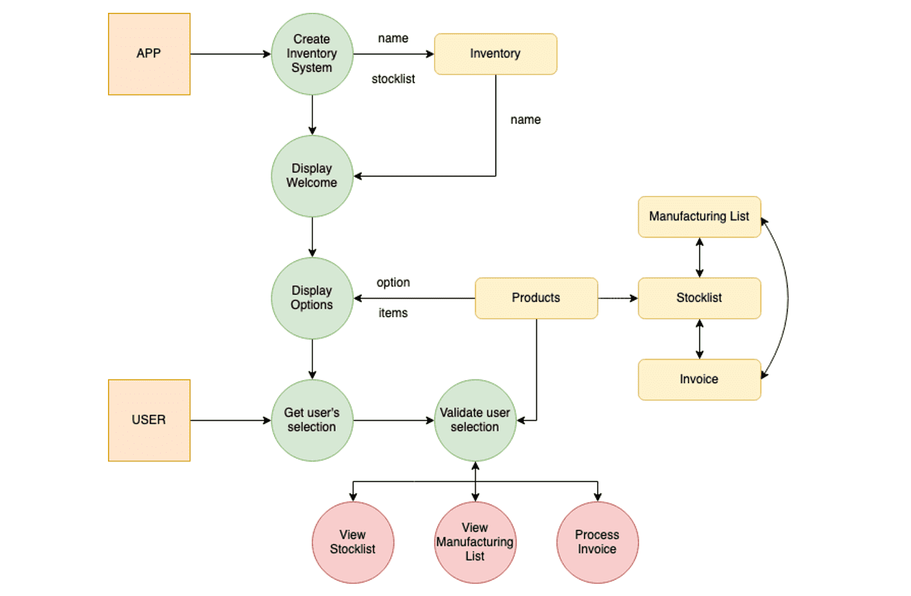
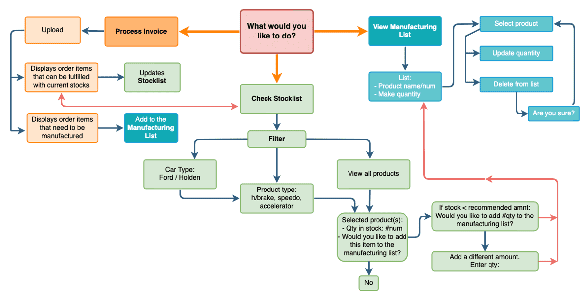
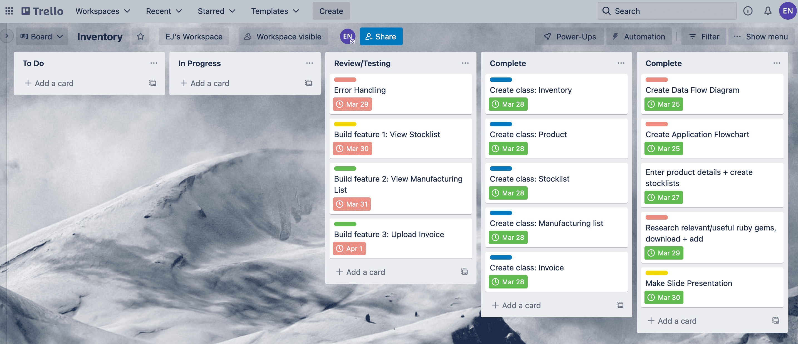
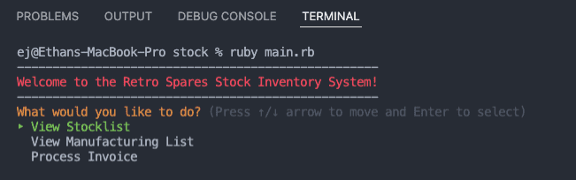
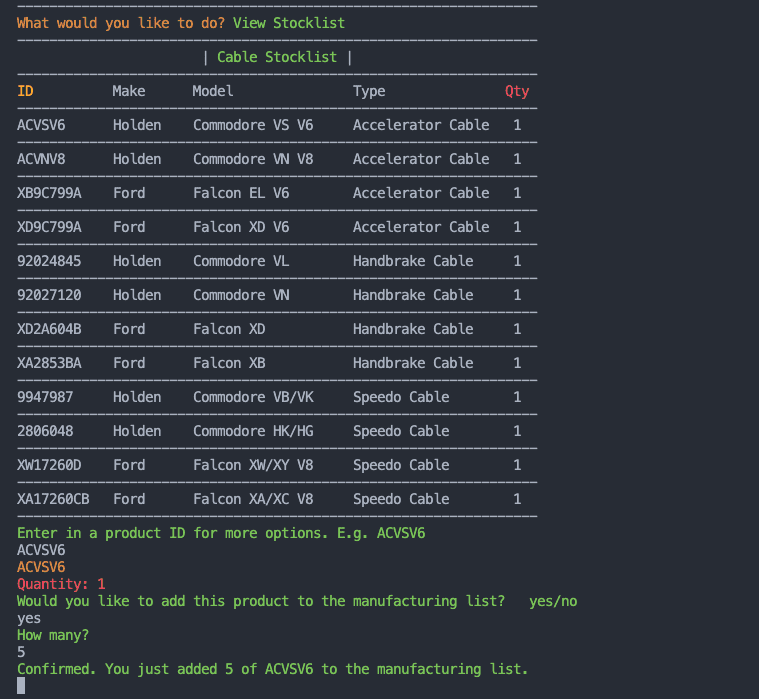

# T1A3 Terminal Application

### Manufacturing inventory system

Ethan J. Neyland

---

#### Link to source control repository:   
https://github.com/ejneyland/stocksystem

---

#### Tech Stack

Programming language: Ruby

Applications: Visual Studio Code

Ruby Gems: rainbow, tty-prompt, json, rspec

---

### The App

This Terminal Application is a Stock Inventory System for my place of (part-time) employment. The business is an automotive parts company. One aspect of the company is the manufacturing of mechanical cables (accelerator, handbrake and speedo cables) for Ford and Holden vehicles. My primary job is to keep the stock quantities up so that orders can be fulfilled as they come in. Currently, the company does not operate on an electronic stock system. Stock are kept in tubs on shelving, and when an order is received the person fulfilling the order will sort through the tubs checking for stock and taking whats required (if adequately stocked), and manufacturing the remaining parts (not stocked). 

This system produces some obvious problems: 
- It is time consuming and inefficient, having to check each product's dedicated stock tub to see if there are any left in stock
- It is difficult to keep track of stock levels
- Low/empty stocks and manufacturing requirements must be kept manually and are not stored

With the development of this stock inventory application, stock levels are able to be stored, monitored and updated in one central location. A manufacturing list of products needing be made for maintaing adequate stock levels and/or to fulfill orders is generated. It would also allow for order invoices to be processed automatically, cross-checking order items with electronically kept stock quantities for each product and updating stock levels and manufacturing lists as required. This would save a lot of time from having to check stock tubs each time an order is received and writing lists of what needs to be manufactured.

---

### Features

#### Feature 1: View Stocklist 

- This feature allows the user to access a list of products and view the quantity of each item in stock
- Product attributes displayed are: ID, make, model, product type & quantity
- The user is able to filter products based on their attributes, in order to refine product searches
  - Make: Ford, Holden or ALL
  - Type: Aceelerator, Handbrake, Speedo or ALL
- Stock quantities are displayed in the color that references their stock status
  - Green: adequately stocked (greater than 3)
  - Yellow: low stock (less than or eq. to 3)
  - Red: out of stock (0)
- After filtering the search through attributes, the user can enter the product number (ID) to reveal more options for that particular product
  - Product details
  - Add product & quantity to the manufacturing list
  - Go back


#### Feature 2: Manufacturing List
- The Manufacturing List is a compiled document of products and specified quantities that need to be manufactured in order to fill stocks and/or fulfil orders
- Products can be added to the manufacturing list from the stocklist itself or from the invoice processing section
- The product number (ID) and the make quantity is displayed in this section
- The user is able to navigate and select products to perform further functions
  - Update the manufacture quantity (positive integers to increase amount, negative integers to reduce amount)
  - Mark list item as complete and update the system
  - Delete item from list (without completion)
- Upon marking a list item as 'complete', the system updates the stocklist quantities and pending invoice order items


#### Feature 3: Process Invoice
- The user can enter in the details of an order, providing the product_number and quantity of multiple items
- This feature returns an order fulfilment receipt, stores an updated order invoice comprised of unfulfilled items and quantities, outputs requirements (e.g. products needing to be added to the manufacturing list) and recommendations (e.g. optional tasks such as adding products low in stock to the manufacturing list)
- Three scenarios are possible when processing an invoice:
- 1\. All order items can be fulfilled with current stock levels
  - The system returns a complete order fulfilment receipt and updates stocklist quantities
- 2\. Order items are partially fulfilled with current stock levels
  - The system returns an order fulfilment receipt, stores an updated order invoice, adds items to the manufacturing list and updates stocklist quantities
- 3\. No order items can be fulfilled with current stock levels
  - The system stores the order invoice and adds item(s) to the manufacturing list

---

### Feature development, implementation plan 

#### Initial data flow diagram



The identified data structures were: Inventory, Products, Stocklist, Manufacturing List and Invoice. External identities were the App and the User. The functions are represented as circles, with the main ones being view stocklist, view manufacturing list and process invoice.

#### App Skeleton



#### Trello Cards



I used Trello Cards to keep track of all the tasks and steps required to build this app. I set dates and colour-coded priority tags for each task for time management purposes, in order to abide by and keep on track with target deadlines. This was done through the creation of a timeline of project milestones, in an order of logical sequence for the construction of my app. I chose not to insert development steps/checklists into my Trello Cards directly, as I personally found it more convenient and accessible to have these steps outlined in pseudocode within my ruby files and in the markdown file. This saved me from switching between my code and my trello project homepage to see what order of steps to follow. In future projects where I am collaborating with multiple people, I will add my steps to the trello tasks so that is readable by others who view it. The steps/checklist for each main task is outlined below. 

#### Option Menu

Steps

1. Define and implement a welcome statement method so that it is displayed upon launch of the app
2. Enter in each option to be presented to the user:
   - 'View Stocklist'
   - 'View Manufacturing List'
   - 'Process Invoice'
3. Initiate main app loop so that upon completing a function the user is returned to the options menu 
4. Create an option selection menu using a case-when statement
5. Implement menu-choice-selection feature using tty-prompt gem, so that user's can navigate using the arrow keys and 'enter'

#### Feature 1: View Stocklist

Steps

1. Create classes for 'Product' and 'Stocklist', initializing attributed and definind meethods specific to objects of each class
2. Add each product and their details/attributes: product ID, make, model, product type and quantity
3. Create a stocklist and assign all products to it
4. Display stocklist to user by using an each-do iteration of each product within the stocklist
5. Create a user input: gets.chomp, prompting user to enter in product ID of the product of interest in order to reveal more options:
   -  Add product to the manufacturing list (& quantity)
   -  'Back'
6. Create an if-else statement, if the user's response matches the ID of a product they are displayed the attribute details of that product and provided with options


#### Feature 2: Manufacturing List

Steps

1. Inherit added products and quantities

#### Feature 3: Process Invoice

Steps

1. Updated invoices (post-processing) stored as a hash

---

### Installation and App Launch Instructions

1. If you don't already, download a terminal emulator such as Visual Studio Code
   - Mac: https://code.visualstudio.com/docs/setup/mac
   - Windows: https://code.visualstudio.com/docs/setup/windows
   - Linux: https://code.visualstudio.com/docs/setup/linux 

2. Download Ruby 
   - Install instructions: https://www.ruby-lang.org/en/documentation/installation/

3. Download bundler gem
   - Install instructions: https://bundler.io 
   - Enter ```gem install bundler``` in terminal

4. Clone repository to your computer
    - Clone repository instructions: https://docs.github.com/en/repositories/creating-and-managing-repositories/cloning-a-repository

5. Install the gems used by the application
   - Enter ```bundle install``` in terminal
   - Gems installed should include: rainbow, tty-prompt, json and rspec

6. Launch the app
   - Enter ```ruby main.rb``` in terminal

--- 

### App Walkthrough


Welcome Menu


View Stocklist


View Manufacturing List


Process Invoice


